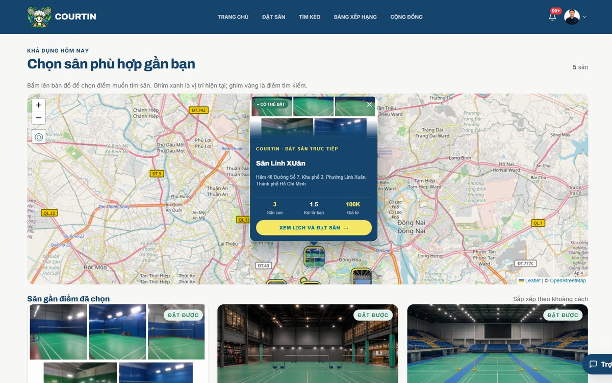
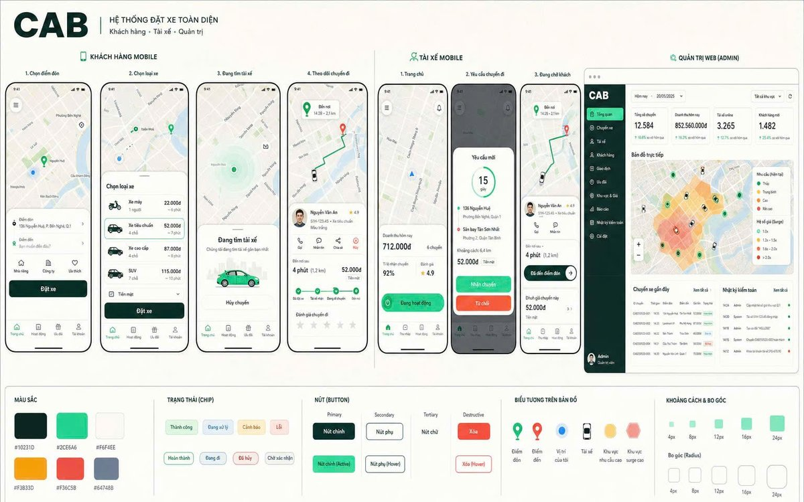

  

### 👋 Hi, I'm Tuấn Anh

Information Systems student at **IUH** (HCMC). I build fullstack products on **event-driven microservices** — React · TypeScript · Node.js · PostgreSQL — and I work **spec-first, AI-native**: requirements and acceptance criteria first, then Claude Code / Codex drafts, then tests and cross-agent review before anything ships. On the BA side I turn workflows into use cases, business rules and testable acceptance criteria.

> **If you only have two minutes, look at these two systems 👇**

---

## ⭐ Featured projects

<table>
<tr>
<td width="50%" valign="top">

###  [Courtin — Badminton Platform](https://github.com/t-anh1007/Badminton-Platform)

Book courts in real time, find matches by skill level, and play **stake-backed competitive matches** — paid via VietQR, settled exactly once.

**🛠 Fullstack**
- **5 Node.js microservices** + API gateway, schema-per-service PostgreSQL, RabbitMQ events via a **transactional outbox**
- Match escrow across **3 services**: VietQR stake → score claim → **12-hour** dispute window → payout, settled exactly once
- React 19 web app with realtime booking & matchmaking — **500** concurrent sockets, `450 → 1` DB query

**📋 Business Analysis**
- Defined **62 core use cases** for players, court owners and admins, phased across 3 releases
- Wrote **198 Given/When/Then acceptance criteria**, validated by automated tests and **8 Playwright E2E journeys**

Full-Stack Developer & BA · team of 2 · Aug 2026 → now

</td>
<td width="50%" valign="top">

### 🚕 [CAB — Ride Booking System](https://github.com/t-anh1007/CAB-Ride-Booking-System)

A ride-hailing platform for customers, drivers and admins: quotes, driver matching, live tracking, ETA and surge pricing — with **Zero Trust** security.

**🛠 Fullstack**
- **11 microservices** + Python AI services behind one gateway
- Kafka dispatcher + outbox on the booking path: throughput **+74%**, p95 latency **−41%** under k6 load
- Auth service with RS256 JWT, OTP login and admin MFA — blocked **11/11** privilege escalations across 15 scenarios

**📋 Business Analysis**
- Mapped end-to-end **Customer, Driver and Admin** workflows: booking, matching, realtime tracking, payment, rating
- Specified role-based access requirements and an auth data model spanning **12 PostgreSQL tables**

Phase 1: Security Engineer · team of 9 · Phase 2: solo maintainer

</td>
</tr>
</table>

---

## 🧰 Tech stack

  

## 🧠 How I work

- **Spec → tests → code.** Courtin started from 10 domain specs and 198 acceptance criteria.
- **Measure, don't guess.** Every performance claim links to a script you can rerun.
- **Design for failure.** Outbox, idempotency keys, exactly-once settlement, circuit breakers.

Open to <b>Fullstack / Business Analyst internships</b> in Ho Chi Minh City — let's talk.

